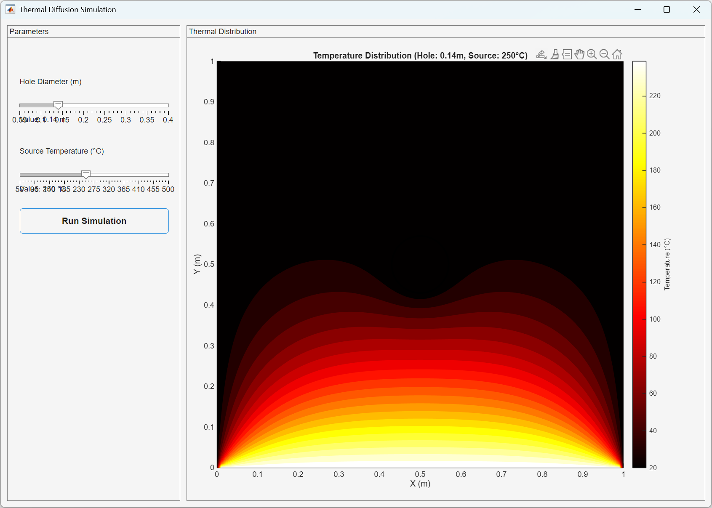

# MCP Series - MATLAB Applications

This repository contains MATLAB applications demonstrating various computational techniques and simulations.

## Overview

A collection of MATLAB scripts and applications showcasing data analysis, modeling, and interactive simulations.

## Applications

### 1. Linear Regression
**Location:** `linear-regression/`

A simple linear regression example that demonstrates:
- Data generation with controlled noise
- Polynomial fitting using `polyfit`
- Model evaluation with R-squared metric
- Visualization of data and fitted line

**Features:**
- Generates synthetic data with a known linear relationship
- Performs least-squares linear regression
- Calculates goodness-of-fit metrics
- Creates scatter plots with fitted regression line

**Usage:**
```matlab
cd linear-regression
linear_regression
```

### 2. Thermal Diffusion App
**Location:** `thermal-diffusion-app/`



An interactive MATLAB App Designer application for simulating thermal diffusion in materials with holes.

**Features:**
- Interactive GUI with parameter sliders
- Real-time thermal diffusion simulation
- Adjustable hole diameter (0.05 - 0.4 m)
- Adjustable source temperature
- Visual representation of temperature distribution

**Usage:**
```matlab
cd thermal-diffusion-app
ThermalDiffusionApp
```

## Requirements

- MATLAB R2020a or later (recommended)
- No additional toolboxes required for basic functionality

## Getting Started

1. Clone or download this repository
2. Navigate to the desired application folder
3. Run the corresponding MATLAB script or app

## Repository Structure

```
MCP-series/
├── README.md
├── linear-regression/
│   └── linear_regression.m
└── thermal-diffusion-app/
    └── ThermalDiffusionApp.m
```

## Contributing

Feel free to add more applications or improve existing ones. Each application should be placed in its own folder with descriptive naming.

## License

This project is provided as-is for educational and demonstration purposes.

---

*Last updated: November 21, 2025*
