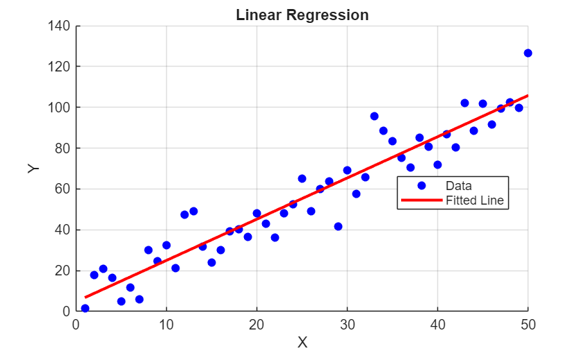

# Linear Regression in MATLAB

This Live Script demonstrates how to perform linear regression analysis on sample data, including visualization and statistical evaluation.


# Generate Sample Data

We start by creating synthetic data with a linear relationship plus random noise. The data follows the equation $y=2x+5+\textrm{noise}$.

```matlab

% Set random seed for reproducibility
rng(42);

% Generate x values from 1 to 50
x = (1:50)';

% Generate y values with linear relationship and noise
% True relationship: y = 2x + 5
y = 2*x + 5 + 10*randn(size(x));

```
# Perform Linear Regression

Using MATLAB's `polyfit` function, we fit a first\-degree polynomial (linear) to the data. The `polyval` function then evaluates this fitted line across all x values.

```matlab

% Fit a polynomial of degree 1 (linear)
p = polyfit(x, y, 1);

% Evaluate the fitted line
y_fit = polyval(p, x);

```
# Display Regression Results

The slope (m) and intercept (b) define the fitted line equation $y=mx+b$.

```matlab

% Display results
fprintf('Linear Regression Results:\n');
```

```matlabTextOutput
Linear Regression Results:
```

```matlab
fprintf('Slope (m): %.4f\n', p(1));
```

```matlabTextOutput
Slope (m): 2.0224
```

```matlab
fprintf('Intercept (b): %.4f\n', p(2));
```

```matlabTextOutput
Intercept (b): 4.7331
```

```matlab
fprintf('Equation: y = %.4f*x + %.4f\n', p(1), p(2));
```

```matlabTextOutput
Equation: y = 2.0224*x + 4.7331
```


# Calculate R\-squared Value

The R\-squared statistic measures how well the fitted line explains the variance in the data. Values closer to 1 indicate better fit.

```matlab

% Calculate sum of squared residuals
ss_res = sum((y - y_fit).^2);

% Calculate total sum of squares
ss_tot = sum((y - mean(y)).^2);

% Calculate R-squared
r_squared = 1 - (ss_res / ss_tot);
fprintf('R-squared: %.4f\n', r_squared);
```

```matlabTextOutput
R-squared: 0.9051
```


# Visualize the Results

The plot below shows the original data points as blue circles and the fitted regression line in red.

```matlab

% Create scatter plot of original data
scatter(x, y, 'b', 'filled');
hold on;

% Plot the fitted line
plot(x, y_fit, 'r-', 'LineWidth', 2);

% Add labels and formatting
xlabel('X');
ylabel('Y');
title('Linear Regression');
legend('Data', 'Fitted Line', 'Location', 'best');
grid on;
hold off;
```


